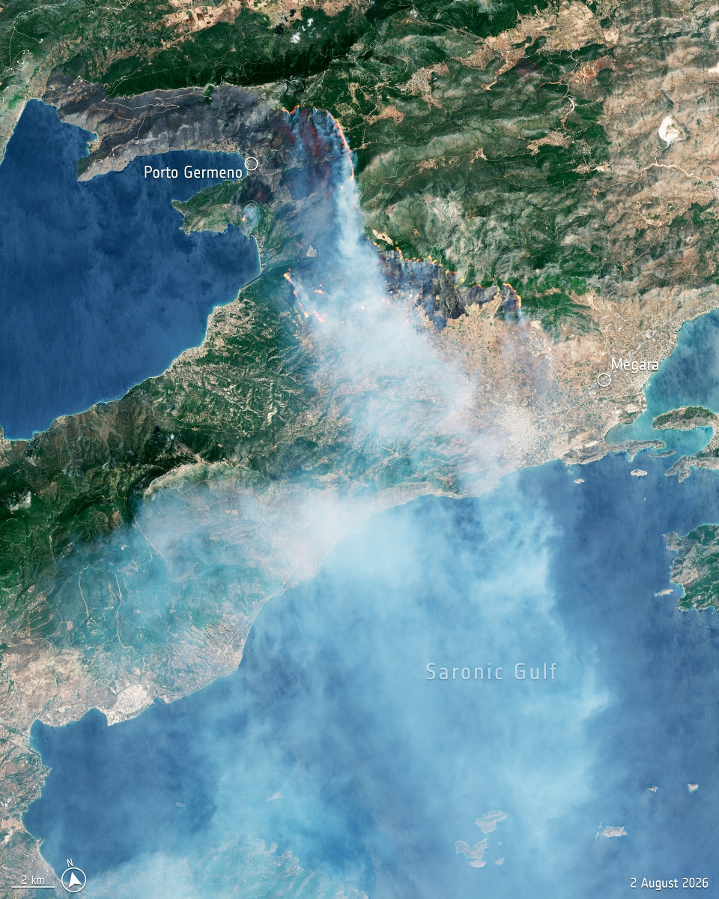
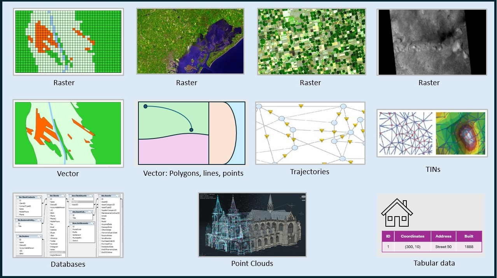

:::::::::::::::::::::::::::::::::::::: questions

- What are the different formats of geospatial data?
- How can geographic phenomena be represented in data formats?
- What is spatial-temporal data and how is it used?

::::::::::::::::::::::::::::::::::::::::::::::::

::::::::::::::::::::::::::::::::::::: objectives

- List different formats of geospatial data
- Describe geographic phenomena and their corresponding data formats
- Explain spatial-temporal data and its applications
- List data types and their properties for geospatial analysis

::::::::::::::::::::::::::::::::::::::::::::::::

## Introduction

Data is everywhere, and geospatial data is no exception. Geospatial data refers
to information that has a geographic component, meaning it can be mapped to a
specific location on the Earth's surface. Think of satellite imagery, aircrafts,
UAVs, GPS devices, mobile phones, and even social media platforms that collect
GPS coordinates. This type of data is crucial for understanding spatial
relationships and is invaluable for solving some of the greatest challenges,
including climate change adaptation, natural disaster monitoring, water resource
management, and food security for a growing global population.

{alt="Observing the Earth"}
Source: [The European Space Agency (ESA), Copernicus Sentinel-2 image](https://www.esa.int/Applications/Observing_the_Earth/FutureEO/Space_for_our_climate/Wildfires_drought_and_extreme_heat_2026)

But how do we represent geospatial data? This is what we will explore in this
lesson. We will discuss the different formats of geospatial data, how geographic
phenomena can be represented in these formats, and the concept of
spatial-temporal data.

To get started, we need to use a programming language that can read geospatial
data and visualize it. In this lesson, we will use Python, a popular programming
language that has a rich ecosystem of open-source libraries for data science and
geospatial analysis. In the sections that follow, we will introduce you to the
basics of geospatial data and analysis using Python. Make sure that you have
followed the setup instructions in the [lesson setup](../learners/setup.md) page
before proceeding.

### Geospatial Data Structures and Formats

When we talk about formats of geospatial data, we are referring to the different
ways in which geographic information can be represented. There are several
formats, each with its own advantages and use cases. Some of the most common
formats include:

- **Raster data**: These formats represent geographic information as a grid of
  cells or pixels, where each cell has a value representing a specific
  attribute. Sometimes, raster data can be a group of images/bands that
  represent different attributes of the same geographic area. Common raster
  formats include [GeoTIFF
  (.tif)](https://www.earthdata.nasa.gov/about/esdis/esco/standards-practices/geotiff),
  [NetCDF
  (.nc)](https://www.earthdata.nasa.gov/about/esdis/esco/standards-practices/netcdf-classic-64-bit-offset-file-formats),
  and [HDF5 (.hdf5)](https://www.hdfgroup.org/solutions/hdf5/).

- **Vector data**: These formats represent geographic features as points, lines,
  and polygons. Common vector formats include [Shapefiles
  (.shp)](https://desktop.arcgis.com/en/arcmap/latest/manage-data/shapefiles/what-is-a-shapefile.htm),
  [GeoJSON (.geojson)](https://geojson.org/), and [KML
  (.kml)](https://www.ogc.org/standards/kml/).

- **Tabular data**: These formats store geographic information in a tabular
  structure, often with latitude and longitude coordinates. Common tabular
  formats include [CSV
  (.csv)](https://data.europa.eu/apps/data-visualisation-guide/csv-files).

- **Triangulated Irregular Networks (TINs)**: These formats represent geographic
  surfaces as a network of interconnected triangles. TINs are often used for
  representing terrain and elevation data. One of the common TIN formats is [LAS
  (.las)](https://www.ogc.org/standards/las/).

- **Point Clouds**: These formats represent geographic features as a collection of
  points in three-dimensional space. Point clouds are often used for representing
  3D models of buildings, landscapes, and other objects. Common point cloud
  formats include [LAS (.las)](https://www.ogc.org/standards/las/).

- **Databases**: These formats store geographic information in a
  database, allowing for efficient querying and analysis. Common database
  formats include [PostGIS (an extension of PostgreSQL)](https://postgis.net/) and [SpatiaLite (an
  extension of SQLite)](https://www.gaia-gis.it/fossil/libspatialite/index).

- **Trajectories**: These formats store the movement of objects over time, often
  with timestamps and coordinates. Common trajectory formats include [GPX
  (.gpx)](https://wiki.openstreetmap.org/wiki/GPX) and [CSV
  (.csv)](https://data.europa.eu/apps/data-visualisation-guide/csv-files).

{alt="Data Structures and Formats"}; license: CC BY-SA 4.0.

::::::::::::::::::::::::::::::::::::: callout

To learn more about raster and vector data, check out these lessons:

- [Introduction to Raster
  Data](https://esciencecenter-digital-skills.github.io/geospatial-python/01-intro-raster-data.html).
- [Introduction to Vector
Data](https://esciencecenter-digital-skills.github.io/geospatial-python/02-intro-vector-data.html).

::::::::::::::::::::::::::::::::::::::::::::::::

::::::::::::::::::::::::::::::::::::: challenge

## Challenge 1: the format of our dataset

Look at [the dataset](../learners/setup.md) we will be using in this lesson.
What format is it in? Is it a raster, vector, tabular, database, or trajectory
format? How do you know?

:::::::::::::::::::::::: solution

## Answer

:::::::::::::::::::::::::

::::::::::::::::::::::::::::::::::::::::::::::::

::::::::::::::::::::::::::::::::::::: keypoints

::::::::::::::::::::::::::::::::::::::::::::::::
